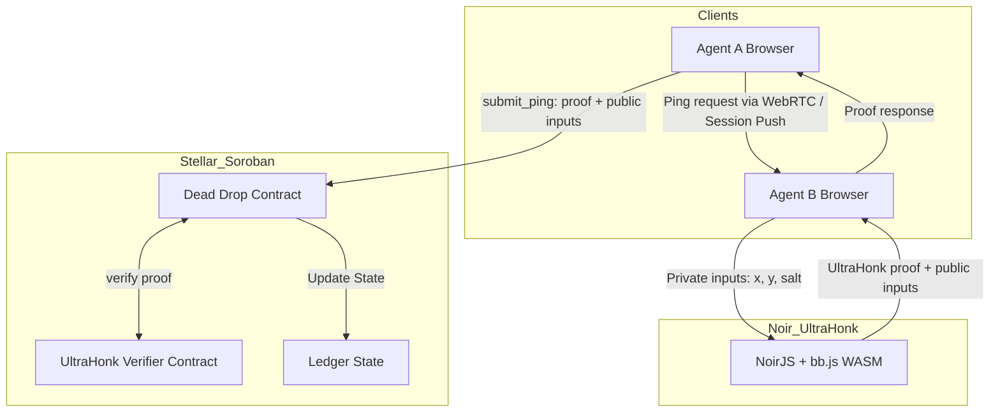

# ☢️ DEAD DROP: Trustless Pathfinding on Stellar

> **Two agents. Two secrets. One hidden drop.**
>
> *Built for the "ZK Gaming on Stellar" Hackathon 2026*


## 🕵️‍♂️ The Mission

**Dead Drop** is a 1v1 strategy game of hidden information where "trust me" isn't good enough. 

In traditional multiplayer games, a central server knows everything—it hides the treasure, it resolves the moves, and players must trust it not to cheat. In **Dead Drop**, we solve the **"God View" Paradox** using Zero-Knowledge proofs.

**The Drop exists nowhere.** It is mathematically defined by the sum of two secret coordinates held privately by the players. Neither player knows where it is at the start, but both can mathematically prove how far they are from it without ever revealing their secrets.

## 🧠 The Mechanic: "Nuclear Keys" Protocol

We use a **Distributed Secret Sharing** scheme powered by **Noir + UltraHonk** and **Stellar Soroban**:

1.  **The Split**:
    - **Agent A** generates secret coordinate $S_A$.
    - **Agent B** generates secret coordinate $S_B$.
    - The **Drop** location is $D = S_A + S_B \pmod{Grid}$.
    - Neither player can calculate $D$ alone.

2.  **The Hunt**:
    - Agent A makes a guess on the grid.
    - Agent B's client automatically receives the guess (via WebRTC / Session Push relay) and computes the distance to the Drop.
    - **CRITICAL STEP**: Agent B's browser generates a **ZK Proof** (using Noir + UltraHonk, entirely in-browser via WASM) that proves: *"I computed the distance correctly using my secret $S_B$, and my secret matches the Poseidon2 commitment I posted on-chain."*

3.  **The Verification**:
    - The proof is submitted to the **Dead Drop Contract** on Stellar.
    - The contract verifies the proof on-chain (using the **UltraHonk Verifier**).
    - If valid, the distance is revealed to Agent A.
    - **Zero Information Leakage**: Agent A learns *only* the distance, nothing about $S_B$.

## ✨ Key Innovations

### 1. Frictionless "Smart Sessions" (Passkeys)
Traditional blockchain games plague users with wallet popups for every move. Dead Drop solves this with **Smart Accounts & Session Keys**:
*   **One-Click Login**: Authenticate instantly using FaceID/TouchID (Passkeys) via [Smart Wallet Kit](https://github.com/kalepail/smart-account-kit).
*   **Session Keys**: The master account authorizes a temporary, scoped session key stored in the browser's local storage.
*   **Invisible Signing**: All gameplay actions (pings, reveals) are signed automatically in the background. **Zero popups** during the heat of the game.

### 2. Instant "Room Code" Lobby
Matchmaking shouldn't require copy-pasting long public keys.
*   **Host**: Creates a game and receives a simple 6-digit code.
*   **Join**: Opponent enters the code to connect.
*   **Single-Sig Architecture**: The contract is designed for asynchronous, single-sided funding. The host funds their stake, the joiner funds theirs, and the Game Hub atomically links them.

### 3. Trustless P2P State Channels
While the contract enforces rules, the gameplay happens at the speed of the web.
*   **WebRTC**: Agents establish a direct peer-to-peer data channel for sub-second latency.
*   **Optimistic UI**: The frontend visualizes results immediately while the ZK proof is verifying on-chain.
*   **Auto-Responder**: Your client automatically generates proofs for your opponent's queries, creating a seamless "server-like" experience without a central server.

### 4. Gasless Gameplay (Relayer)
New users shouldn't need XLM to start playing.
*   **OpenZeppelin Relayer**: We integrate with [OpenZeppelin Defender](https://developers.stellar.org/docs/tools/openzeppelin-relayer) to sponsor transaction fees.
*   **Meta-Transactions**: Users sign the game actions (pings), but the Relayer submits the transaction and pays the gas. This allows for a true "Web2-like" onboarding flow where an email/passkey is all you need.

### 5. Provable "Unfairness" (Gadgets)
We use a **Shared Entropy** protocol to generate deterministic, hidden power-ups.
*   **Seeded from Commitments**: The combined hash of both players' secrets `H(Sa + Sb)` seeds a deterministic RNG.
*   **ZK-Verified Abilities**: Players can use gadgets like **Sat-Link** (reveal a quadrant) or **Intercept** (steal opponent's distance).
*   **The Innovation**: The contract doesn't know *what* gadget you have, only that you have a valid proof deriving it from the shared seed. This allows for complex "fog of war" mechanics on a public ledger.

## 🎥 Demo

[](https://www.youtube.com/watch?v=placeholder)

*Watch the 2-minute walkthrough of a full game session.*

## 🏗️ Architecture



## 🛠️ Tech Stack

*   **Smart Contracts**: Stellar Soroban (Rust)
    *   Implements game state machine, Poseidon2 commitments, and UltraHonk proof verification.
*   **ZK Proving**: Noir (`@noir-lang/noir_js ^1.0.0-beta.18`) + Barretenberg (`@aztec/bb.js ^2.1.11`)
    *   Circuit written in Noir, compiled to ACIR bytecode.
    *   All proofs generated **client-side** in the browser via WASM — no backend prover needed.
    *   Commitment scheme: `Poseidon2(x, y, salt)` via `@zkpassport/poseidon2`.
*   **Verification**: UltraHonk Verifier Contract
    *   On-chain verification of UltraHonk proofs.
*   **P2P Transport**: WebRTC DataChannel + Session Push relay
    *   Responder proves in-browser, sends proof to pinger over direct P2P or HTTP relay fallback.
*   **Frontend**: React + Stellar SDK + Tone.js
    *   Connects to standard Stellar wallets (Freighter) or dev signers.
    *   Real-time sound engine for ambient loop and gameplay feedback.

## 🚀 Getting Started

### Prerequisites

*   [Bun](https://bun.sh/) (v1.0+)
*   [Rust](https://www.rust-lang.org/) (latest stable)
*   [Stellar CLI](https://developers.stellar.org/docs/tools/developer-tools/cli/stellar-cli) (`stellar`)

### Installation

1.  **Clone the repository**
    ```bash
    git clone https://github.com/your-username/dead-drop.git
    cd dead-drop
    ```

2.  **Install dependencies**
    ```bash
    bun install
    ```

3.  **Setup Local Environment**
    This script compiles contracts, deploys them to Testnet, and generates TypeScript bindings.
    ```bash
    bun run setup
    ```

### running the Game

1.  **Start the Development Server**
    ```bash
    bun run dev:game dead-drop
    ```

2.  **Play!**
    *   Open `http://localhost:5173`.
    *   Connect your wallet (Freighter recommended).
    *   Create a game and invite a friend (or use a second browser window with a different wallet).

## 🧩 How to Win (The Hackathon Track)

We are submitting to the **ZK Gaming on Stellar** track.

*   **ZK-Native Mechanic**: The game *cannot exist* without ZK. The hidden information is the core puzzle.
*   **Protocol 25**: We leverage the new BN254/Poseidon host functions for efficient on-chain verification.
*   **Fairness**: Provable fairness is baked into every turn. No trusted server required.

## 📜 License

MIT License.

---
*Built with [Stellar Game Studio](https://github.com/jamesbachini/Stellar-Game-Studio)*
