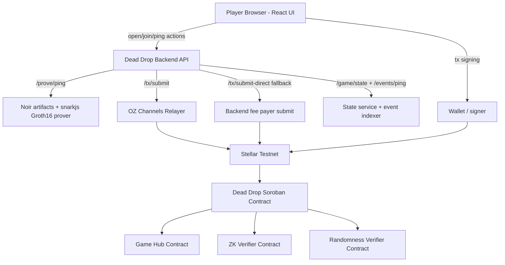

# Dead Drop: ZK-Powered Hidden-Information Hunt on Stellar

Built for the **ZK Gaming on Stellar** hackathon (2026): a 1v1 game where Zero-Knowledge proofs are required to reveal distances to a hidden target without revealing the target itself.

## Hackathon Fit (Judge Checklist)

- **ZK-powered mechanic**: Each ping reveals only a distance, backed by a ZK proof that the distance is correct.
- **Deployed onchain component (Stellar Testnet)**: Dead Drop Soroban contract + verifier contracts + Game Hub integration.
- **Game Hub requirement**: The contract calls `start_game()` and `end_game()` (required by hackathon rules).
- **Frontend**: Playable React web UI for lobby, join, ping submission, and turn progression.
- **Open-source repo**: This repository contains contracts, frontend, backend prover/relayer, and scripts.
- **Video demo**: https://youtu.be/oS6AeBsSws0

## What the Game Is

**Dead Drop** is a 2-player hidden-information game on a **100x100 toroidal grid** (wrap-around edges).

- Players create/join a lobby using a room code.
- The game starts onchain with a hidden `drop_commitment`.
- Players alternate turns submitting a ping coordinate.
- The game reveals the **distance** from the ping to the hidden drop, but not the drop location.
- A turn is only accepted if the submitted distance is backed by a valid ZK proof.
- The first exact hit (`distance == 0`) wins, or the best distance wins after max turns.

## Why ZK Is Essential (Not Just Mentioned)

Without ZK, one player (or a server) could lie about the distance and manipulate the game.

In Dead Drop, the ZK proof is a core gameplay primitive:

- The player submits a ping plus a **claimed distance**.
- The contract rebuilds the expected public inputs from onchain state and submitted params.
- The contract verifies a ZK proof via a verifier contract.
- If the proof is valid, the distance is accepted and the turn advances.

What players learn:

- The ping coordinate (public)
- The distance result (public)

What remains hidden:

- The actual drop coordinates
- Private witness values used to prove the distance computation

This is exactly the kind of “trust me is not good enough” mechanic the hackathon asks for.

## Architecture (Current Prototype)

### Onchain (Stellar Soroban)

- `contracts/dead-drop/src/lib.rs`
  - Lobby flow: `open_game`, `join_game`
  - Gameplay: `submit_ping`, `force_timeout`
  - Reads: `get_game`, `get_lobby`
  - Calls Game Hub `start_game()` / `end_game()`
  - Verifies:
    - ping proofs via verifier contract (`verify_proof`)
    - randomness attestation via randomness verifier (`verify_randomness`)

### Backend (Prover + Relayer + State API)

- `backend/dead-drop-prover/server.js`
  - `/randomness/session` for per-session randomness artifacts
  - `/prove/ping` for ZK proof generation
  - `/tx/submit` and `/tx/submit-direct` for relayer/direct submission
  - `/events/ping` and `/game/state` for frontend sync
- `backend/dead-drop-prover/prover.js`
  - Generates proofs using Noir artifacts + `snarkjs` Groth16
- `backend/dead-drop-prover/eventIndexer.js`
  - Indexes ping events for frontend display
- `backend/dead-drop-prover/gameStateService.js`
  - Reads contract state and returns merged game + events snapshot
- `backend/dead-drop-prover/relayer.js`
  - OpenZeppelin Channels relayer integration

### Frontend (Playable Web Game)

- `dead-drop-frontend/`
  - React + Vite UI
  - Wallet integration (dev wallets / Stellar signers)
  - Lobby + room code UX
  - Turn-based map interaction
  - Backend-powered proof generation and game-state syncing
  - Relayer path with direct fallback for unsupported auth shapes



## Technologies Used (What / Why / How)

| Technology | Why it matters for this hackathon | How this project uses it |
|---|---|---|
| **Stellar Soroban (Rust)** | Required onchain component; enforces game rules and verifiable outcomes | `contracts/dead-drop/src/lib.rs` implements lobby/game state machine, turn rules, proof verification calls, and Game Hub integration |
| **Stellar Game Studio** | Speeds up onchain game development and required ecosystem integration patterns | Repo structure, scripts (`setup`, `build`, `deploy`, `bindings`, `dev:game`), Game Hub integration conventions |
| **Stellar Game Hub** | Required for hackathon lifecycle tracking | Dead Drop contract calls `start_game()` and `end_game()` |
| **`@stellar/stellar-sdk`** | Core client + backend interaction with Soroban/Testnet | Used in frontend tx building/signing and backend RPC/transaction submission |
| **Noir (circuit artifacts / interop witness generation)** | ZK circuit authoring path for distance proof logic | Circuit artifacts live under `circuits/dead_drop/`; backend prover uses `noir-cli interop` to generate witness |
| **Groth16 + `snarkjs`** | Practical proof generation for prototype ZK mechanic | `backend/dead-drop-prover/prover.js` generates ping proofs and public signals using Groth16 |
| **Poseidon2 (`@zkpassport/poseidon2`)** | ZK-friendly hashing relevant to Protocol 25 / modern ZK systems | Used in backend prover to compute/validate drop commitments |
| **OpenZeppelin Relayer Channels** | Gasless / sponsored submission UX and better onboarding | Backend relayer integration via `backend/dead-drop-prover/relayer.js`; frontend submits via `/tx/submit` |
| **React + Vite** | Fast iteration and judge-friendly playable UI | `dead-drop-frontend` game UI, lobby/join flow, state sync, map rendering |
| **Backend Game State Service + Event Indexer** | Smooth gameplay UX despite RPC/cache lag | `/game/state` and `/events/ping` aggregate onchain state/events for frontend |
| **Tone.js** | Better player experience (feedback matters in demos) | Ambient and gameplay sound cues in Dead Drop frontend |
| **WebSocket relay / real-time backend endpoints** | Supports multiplayer coordination and proof/result exchange patterns | Relay endpoints exist in backend (`/relay/*`, websocket server) and support real-time flows |

## ZK Mechanic Deep Dive (Implemented Flow)

### Hidden Drop Commitment

- A per-session randomness flow produces:
  - `randomness_output`
  - `randomness_signature`
  - `drop_commitment`
- The contract verifies the randomness artifacts using a randomness verifier contract before starting the game.

### Ping Proof Flow

1. A player chooses a ping coordinate `(ping_x, ping_y)`.
2. Frontend requests proof generation from backend `/prove/ping`.
3. Backend prover computes the wrapped Manhattan distance and generates a ZK proof.
4. Frontend submits `submit_ping` with:
   - `proof`
   - `public_inputs`
   - ping metadata
5. Dead Drop contract:
   - checks turn ownership / turn number
   - reconstructs expected public inputs from onchain state
   - validates the submitted public inputs match expected values
   - calls verifier contract to verify proof
   - emits ping event and advances game state

### Public Inputs Layout (Contract-Enforced)

From `contracts/dead-drop/src/lib.rs`:

- `[session_id, turn, ping_x, ping_y, drop_commitment, expected_distance]`

This matters because the contract independently reconstructs this layout before accepting a proof.

## Onchain Component + Game Hub Compliance (Hackathon Requirement #2)

- **Required Game Hub contract ID (hackathon prompt)**:
  - `CB4VZAT2U3UC6XFK3N23SKRF2NDCMP3QHJYMCHHFMZO7MRQO6DQ2EMYG`
- This repo’s `deployment.json` currently points `mockGameHubId` / `mock-game-hub` to that same ID on testnet.
- Dead Drop contract calls:
  - `start_game()` when a match starts (including lobby `join_game`)
  - `end_game()` when a winner is finalized

Relevant contract file:

- `contracts/dead-drop/src/lib.rs`

## Current Testnet Deployment (from `deployment.json`)

- Network: `testnet`
- RPC: `https://soroban-testnet.stellar.org`
- Dead Drop contract: `CDCPVLFUIRLHUQOHYR7CEPBIMVZZU7URDYWFURJPXYJREQZK5IQBG4QY`
- Game Hub (required): `CB4VZAT2U3UC6XFK3N23SKRF2NDCMP3QHJYMCHHFMZO7MRQO6DQ2EMYG`
- Dead Drop verifier contract: `CA7T3FJMCIJ6HA3Z56VVD7J5A2HLZ5JLWNPODB43GML7JJSQHSWWSQKC`
- Dead Drop randomness verifier contract: `CCN7MNB7GCJG23NZKMUCCPCMSMYZK7UA5NOXZD5GCJLCITWZIOIGHVVF`

Note: If you redeploy, update the README and frontend/runtime config before final submission.

## Repository Structure (Judge-Friendly)

- `contracts/dead-drop/` — Soroban game contract (lobby, gameplay, proof verification, Game Hub calls)
- `dead-drop-frontend/` — React/Vite game UI and transaction orchestration
- `backend/dead-drop-prover/` — backend prover, relayer integration, event indexer, game-state API
- `circuits/dead_drop/` — Noir circuit + Groth16 artifacts (`.zkey`, circuit JSON)
- `noir-groth16-reference/` — Active Groth16 verifier infrastructure and Powers of Tau
- `bindings/` — generated TS bindings for contracts
- `scripts/` — build/deploy/bindings/dev workflows (Stellar Game Studio)
- `deployment.json` — current testnet contract IDs and runtime metadata
- `docs/archive/` — historical development documentation

### Contract Organization

**Active Contracts (Deployed for Dead Drop):**
- `contracts/dead-drop/` - Main game contract (lobby, gameplay, ZK verification)
- `contracts/mock-game-hub/` - Required Game Hub integration for hackathon

**Reference Templates (Stellar Game Studio Framework):**
- `contracts/number-guess/` - Simple guessing game pattern
- `contracts/dice-duel/` - Dice rolling with deterministic randomness
- `contracts/twenty-one/` - Blackjack-style game

Dead Drop was built using the Stellar Game Studio framework, which this repo is based on. The reference templates demonstrate the framework patterns but are not part of the Dead Drop game itself.

**Proof System:**
- `noir-groth16-reference/` - Active Groth16 verifier infrastructure and tooling
- `circuits/dead_drop/` - Noir circuits and Groth16 artifacts for Dead Drop proofs

## Getting Started (Local Demo)

### Prerequisites

- [Bun](https://bun.sh/)
- [Rust](https://www.rust-lang.org/)
- Stellar CLI / Soroban tooling (for contract build/deploy workflows)

### Install

```bash
bun install
```

### Setup (contracts + bindings + env)

```bash
bun run setup
```

### Run the backend prover/relayer API

```bash
bun run dev:prover
```

### Run the frontend game

```bash
bun run dev:game dead-drop
```

Then open the local frontend (typically Vite on localhost) in two browser windows / profiles and use two wallets (or dev wallets) to play.

### Optional proof flow validation

```bash
bun run proof:test:dead-drop
```

## Submission Requirements Mapping

1. **ZK-Powered Mechanic**  
   Dead Drop uses ZK proof verification as the core ping-distance mechanic.

2. **Deployed Onchain Component (Stellar Testnet)**  
   Dead Drop Soroban contract + verifier contracts; Game Hub integration included.

3. **Front End**  
   Playable `dead-drop-frontend` with lobby, join, and ping flows.

4. **Open-source Repo**  
   This repository.

5. **Video Demo**
   https://youtu.be/oS6AeBsSws0

## Acknowledgements

- [Stellar Game Studio](https://github.com/jamesbachini/Stellar-Game-Studio)
- Stellar ZK Gaming hackathon organizers and community support channels

## License

MIT

